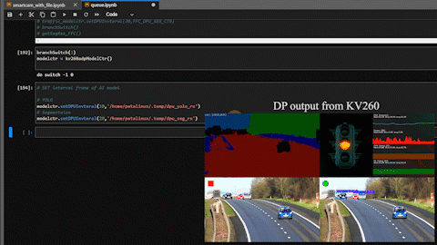
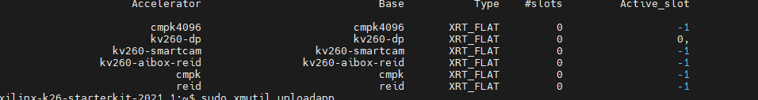
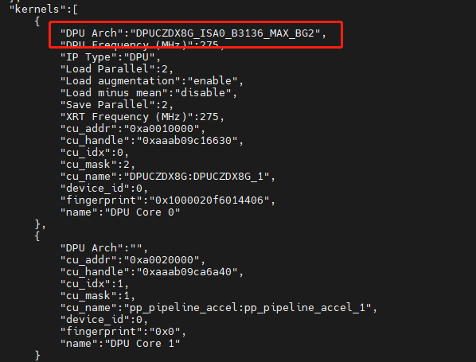
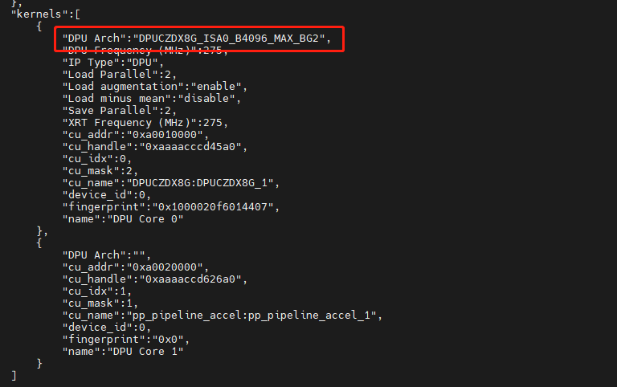
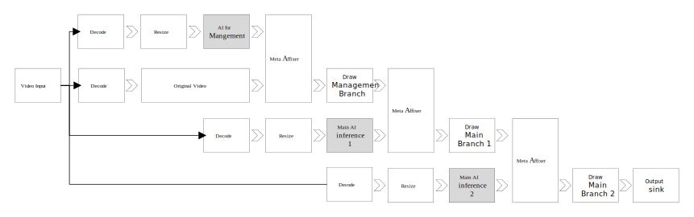
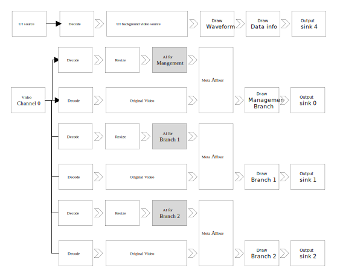
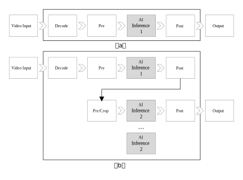
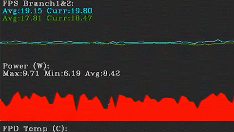
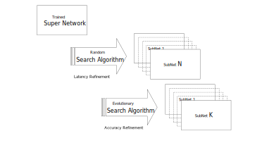

# Xilinx Adaptive Challenge 2021

----->Logo here<------


## Introduction
Deep neural networks (DNNs) is the key technique in modern artificial intelligence (AI) that has provided state-of-the-art accuracy on many applications, and due to this, they have received significant interest. The ubiquity of smart devices and autonomous robot systems are placing heavy demands on DNNs-inference hardware with high energy and computing efficiencies along with rapid development of AI techniques. The high energy efficiency, computing capabilities and reconfigurability of FPGA make it a promising platform for hardware acceleration of such computing tasks. 

In this challenge, we have designed a flexible video processing framework on a KV260 SoM, which can be used in a smart camera for intelligent transportation system (ITS) application. Our framework is not only capable to automatically detect application scenarios (e.g. Car or Pedestrian) using a semantic segmentation network, and it is also able to automatically select best of the DNN models for the application scenarios. Thanks for the dynamic reconfiguration and rum-time management APIs, our system is able to dymanicly switching the DNN inference model at run-time without stop the video pipeline. This finally allows our smart camera system to be __truly adaptive__, and achieve the __best performance__ in a __smarter way__.

### Requirements
- Vitis-AI 1.4.1
- Vivado 2021.1
- PetaLinux 2021.1
- KV260
- HDMI monitor and cable
- HD camera (Option)


## Demo videos


### Branch switch for different scenarios (4k resolution with 4 channels @ 1080p)


This video shows the switch of AI processing branches for different scenarios. According to the detected scenarios, the corresponding AI inference will be enabled or disabled.
- Branch 0 (left top): for scenario classification.
- Branch 1 (left bottom): enable in people scenarios.
- Branch 2 (right bottom): enable in car scenarios.

###  Inference interval

  

https://youtu.be/EY3WWD4jYp4  
This shows the realtime adjustment of inference interval in Jupyter.

### Model size and type
  

https://youtu.be/rI5IlkQ1GYE  
Running applications tracking for cars: Yolo + CarID + tracking
This video shows the real-time adjustment of model size in Jupyter. There are 4 different model sizes of CarID for different workloads.  This video shows the case that fps increases with smaller model. 

It is also supported to change AI model types for different functionalities.    
***Note***: Due to the resolution problems in preprocess plugins, it requires CPU for preprocessing.

### Adaptive optimization
  

https://youtu.be/lOm2LP5qe-M  
This video show the performnace changes with above adaptive optimization methods. 
- Branch 0 (Segmentation):  the inference interval increases (1->5) for less performace cost. 
- Branch 1 (Refindet&Openpose): the inferece is disabled, because there is no person.
- Branch 2 (Yolo): the size of the model decreases and the inference intrerval increases (1->2)  


<!-- ###  UI overlay for one channel and four channels

For one channel and four channels, we provides two kinds of UI overlay for it. 


In the one channel mode, everything will be draw on the same 1080P output. As shown in the video, the segmentation result from management branch and data waveform are put on the top right corner of frames. Users can 


In the four channels mode, the output is 4K resolution. The results drawn on 4 1080P videos streams. As shown in the video, the segmentation results from management branch is put on the top left corner, while the data waveforms are put on the top right.  The results from branch 1 and 2 are put on the bottom. -->


### Hardwre switch
For different cases, we deployed different hardware configuration for switching.  
<!--  -->
The bigger DPU (larger size or higher frequency) consumes more power even if there is no AI inference tasks. Hence, using smaller DPU in low workloads can lower the power consumption.

Currently, we use two different sizes of DPU: 1) B3136 and 2) B4096. The hardwre configuration are packaged into the different firmwares. 

DPU size :B3136  

<!--    -->


DPU size :B4096  Firmware name: cmpk4096  https://github.com/luyufan498/Adaptive-Computing-Challenge-2021/tree/main/firmware   

<!--    -->

About the details of different hardware configuration and performance adjustment please see our previous project： h
ttps://www.hackster.io/378085/adaptive-deep-learning-hardware-for-video-analytics-f8d064


<!-- ## Adaptive
1. Auto branch switch according to the input videos:
    - branch for cars
    - branch for people

2. Realtime adjustment of inference interval accoring to the platform status (e.g. fps, power and tempure):
    - buff or not buff

3. Realtime model swith accoding to the platform status
    - functionality of the program
    - size of the running model

4. Adaptive switch of the DPU size:
    - size of the DPU
    - frequency of the DPU
    - number of DPUs

## Use Model in the demo design -->

## To run the demo

There are a number of parts in our demo: 1) gstreamer video processing pipes, 2) host program for management and 3) hardware firmwares. Please follow the instructions blow to to run the demo.

### Set up the environment

0. Follow the [official instructions](https://xilinx.github.io/kria-apps-docs/main/build/html/index.html) to set up KV260 (smart camera and AIBox-ReID are needed).


### Gstreamer video processing pipes

1. Download our customized VVAS libs to kv260 (/opt/xilinx/lib/):
    - dpuinfer for AI inference to support new model and switch: [libivas_xdpuinfer.so](./vvas_so_lib/libivas_xdpuinfer.so)
    - Crop for Openopse: [libivas_crop_openopse.so](./vvas_so_lib/libivas_crop_openopse.so)
    - To support Openopse: [libivas_openpose.so](./vvas_so_lib/libivas_openpose2.so)
    - Tracking update: [libaa2_reidtracker.so](./vvas_so_lib/libaa2_reidtracker.so)
    - Draw chart/wareform: [libivas_sensor.so](./vvas_so_lib/libivas_sensor.so)
    - Draw running indicator: [libivas_runindicater.so](./vvas_so_lib/libivas_runindicater.so)
    - Draw segmentation: [libivas_performancestatus.so](./vvas_so_lib/libivas_performancestatus.so)
    - Draw pose: [libivas_drawpose.so](./vvas_so_lib/libivas_drawpose.so)
    - Draw box/roadline: [libivas_xboundingbox.so](./vvas_so_lib/libivas_xboundingbox.so)

2. **IMPORTANT**: Update gstreamer plugin lib to support multiple inference channel (/usr/lib/).   
    - [libgstivasinpinfermeta-1.0.so.0](./gst_update/libgstivasinpinfermeta-1.0.so.0)
    - [libgstivasinpinfermeta-1.0.so.0.1602.0](./gst_update/libgstivasinpinfermeta-1.0.so.0.1602.0)

    *Note*: need sudo to overwrite original files.

2. Download [new models](./models/models.zip) and extract to kv260 (/opt/xilinx/share/vitis_ai_library/):


3. Download [new json file for VVAS configuration](./json_configuration/ivas.zip) and extract to kv260 (/opt/xilinx/share)  
    **Note**: Please find the appendix section for description of configuration. 

4. Now, you should be ready run the video pipeline. Download [scripts to start video pipeline](./shell-scripts/gst_reid_4k.sh) to /home/scripts/.
   
   The provided shell scripts can take input parameters for the configuration of video processing :


        Help:
        -f video file source
        -b (optional) segmentation use black background
        -r (optional) model for branch 1  [(reid), openopse]
        -s (optional) to sync videos or not

    Use the following command to run video pipeline:

        sudo ./scripts/gst_reid_4k2.sh -f <video> -r <AI program>

### Set up and run host program

5. Download [Host program](./host_program/video-management-%20example.ipynb) to kv260. Use jupyter to run it.
    
    Example use of python interfaces:
    ```python
    traffic_modelctr = kv260adpModelCtr()
    # Set UI with pipe path
    traffic_modelctr.setIndicaterUI('on',FFC_UI_BRANCH2)
    traffic_modelctr.setIndicaterUI('off',FFC_UI_BRANCH1)
    # SET branch with pipe path
    traffic_modelctr.setDPUenable('on',FFC_DPU_BRANCH_CAR_CTR)
    traffic_modelctr.setDPUenable('off',FFC_DPU_BRANCH_PEO_CTR)
    # SET inference interval with pipe path
    traffic_modelctr.setDPUInvteral(30,FFC_DPU_SEG_CTR)
    # Create a ctr with pipe path and set new model
    modelctr = kv260adpModelCtr("/home/petalinux/.temp/dpu_seg_rx")
    modelctr.setNewModel("ENet_cityscapes_pt","SEGMENTATION","/opt/xilinx/share/vitis_ai_library/models/B3136/")
    ```
### Switch of Hardware design

6. (Optional) load the hardware with the B4096 DPU: 

        sudo xmutil unloadapp
        sudo xmutil loadapp cmpk4096


## Gstreamer video processing pipes in the demo
###  Architecture of the video processing pipes:
 The structure of video processing pipes is as follow. In our demo, there are two types of branches: 1) management branch and 2) main AI inference branch.

   
(Figure: video pipeline in 1080P mode.)


In the one channel (1080P) mode, everything will be draw on the same 1080P output. As shown in the video, the segmentation result from management branch and data waveform are put on the top right corner of frames. Users can 


**In the 1080P mode, the inference information from different branch needs to be drawn on the same frame. However the original Meta Affixer plugin does not support conbination of inference results from different branches. it returns error, when there are muliple inference results. We modified the gstreamer plugin (libgstivasinpinfermeta) to support this feature. Now, the info from the master sink port will be kept, while others will be dropped.**


    
(Figure: video pipeline in 4K mode.)

**In the 4K mode, there is a separate branch (1080p) to draw waveform and UI.**


In the four channels (4k) mode, the output is 4K resolution. The results drawn on 4 1080P videos streams. As shown in the video, the segmentation results from management branch is put on the top left corner, while the data waveforms are put on the top right.  The results from branch 1 and 2 are put on the bottom.


### management branch:

The management branch is responible for checking the scenerio of input videos. As shown in the figures, the management branch runs as a asistant branch with the main AI inference branch.  This branch takes a copyed video stream from main AI inference branch as input, so that it can monitor the video stream simultaneously.

***Note***: considering performance costs, the AI inference in management branch runs on seconds basis. The inference interval can be adjusted by pre-designed interfaces in real time.
    
In our demo, we include two kinds of models for scenerio classification:

1. For segmentation 
    There are two models from ***Model Zoo*** are used in our demo to satisfy different requirments of the accuracy:        
    - pt_ENet_cityscapes_512_1024_8.6G_2.0
    - pt_SemanticFPN-resnet18_cityscapes_256_512_10G_2.0 

    *Note1*: The input size of "512*1024" decreases the performance significantly.  
    *Note2*: current VVAS on KV260 does not support segmentation officially. we use custom pulgins to support Segmentation.

2. Lane detection:
    Lane detection are very useful to detect the region of interest. We use the model for the model zoo:
    - cf_VPGnet_caltechlane_480_640_0.99_2.5G_2.0
        
    *Note*: current VVAS on KV260 does not support Lane detection officially. we use custom pulgins to support Lane detection.


### Main AI inference branches:
The main AI inference branches are responible to operate AI models for corresponding scenairos. In our demo, we include two typical scenarios for smart city system: 1) people scenario and 2) car scenario. Videos from different sceniaros will be proccessed by corresponding branches. If the scenario is not detected, the corresponding branch will also be disabled.

  
(Figure: Pipeline of the management branch)

the structures of the video pipeline are shown in the figure. Considering the different requirements of applications, the video procesing pipe can run one stage or two stage AI inference. 'Video Pipe (a)' represents a typical one stage AI application (e.g. object detection and segmentation), where there is only one AI model to conduct the inference once per frame. 'Video Pipe (b)' represents a two-stage AI application (e.g. tracking, REID and car plates detection), where there are two AI models ruining simultaneously and the second one may run multiple times due the detection results from the first one.

#### Branch for people scenarios:
In people scenarios, the demo can run three kinds of tasks: 1) people detection, 2) ReID and 3) opse detection. 
1. people detection: refinedet. It is from the kv260 ReID example. 
2. ReID: refinedet + crop +personid + tracking. It is from the Kv260 ReID example. 
3. opse detection: refinedet + crop + spnet.
    ***Note***: we use cf_SPnet_aichallenger_224_128_0.54G_2.0 from Xilinx ***Model Zoo***.


#### Branch for car scenarios:
In the car scenarios, the demo can run two task: 1) object detection and 2) car track.
    
1. yolo 
    The object detection models we used are from ***Model Zoo***. We integrate 4 sizes of yolo models in our demo, so that we can dynamically switch it according the video processing speed.  
    -	dk_yolov2_voc_448_448_34G_2.0
    -   dk_yolov2_voc_448_448_0.66_11.56G_2.0
    - 	dk_yolov2_voc_448_448_0.71_9.86G_2.0
    - 	dk_yolov2_voc_448_448_0.77_7.82G_2.0

2. CarID
    We trained and pruned 4 different size of carid model for model switch.
    - RN18_08 [B3136](./models/models/B3136/carid/RN18_08/RN18_08.xmodel)
    - RN18_06 [B3136](./models/models/B3136/carid/RN18_06/RN18_06.xmodel)
    - RN18_04 [B3136](./models/models/B3136/carid/RN18_04/RN18_04.xmodel)
    - RN18_02 [B3136](./models/models/B3136/carid/RN18_02/RN18_02.xmodel)

    ***Note***: RN18_\<xx\> means the percentage of the pruned weights. For example, RN18_08 means 80% of the weights was pruned, so it is the smallest one here.  

3. OFA (Test)


## The plugin to get and draw realtime data on frames




In our demo, we designed a dedicated plugin lib (libivas_xdpuinfer.so) to get data and draw waveform. Please see ***Appendix*** section for detailed configuration.

1. Sample data

    The fist functionality of this lib is getting platform status data. Currently, this lib supports 7 different data sources: 5 preset sources (lpd temperature, fpd temperature, total power, PL temperature and fps) and 2 custom sources. 
    
    When using Preset data sources except fps, the plugin will read the proc file in the petalinux system to get the platform status. 
    
    When using custom data sources, the plugin will read the data from a custom file. In this way, users can display custom data or use it in other boards (we have tested it in ZCU104). 

    FPS is a spacial data sources. Plugin calculates the average fps of the current video processing branch. However it can not get the fps information from other branches, which is inconvenient in 4K mode. In our demo, the fps data can be output to a file, so that the plugin in display branch can read it by using custom data sources. 
    

2. Draw chart

    Another functionality of this lib is to draw waveforms with acceptable performance cost. As shown in the figure, lib can draw the waveform in two different modes: 1) filled mode and 2) line mode. The title and realtime data can also be drawn on the frames.
    
    Due CPU costs of Draw, we also provde a number of paramenters for optimization. It is supproted to disable the title, data and overlay. There is also a optimization option for this lib, so that you can draw half of pixels only on UV planes to lower the costs. In the best case, filled mode costs 150 us, while the line mode costs 50 us.  
   


## Host program

To trigger dynamical switch, there is a python host program to interact with video pipeplines. Because the host program is a separate program, it use IPC to read infomation and send command. 

To use the named pipe to control the video pipeline, there are a few step:
1. Install the new library file (so) to replace the official plugins. 
2. Prepare the configuration file (json) to set communication methods.   
3. Use gstreamer to start a pipeline or use the my shell script to strat the video pipeline.
4. start the Python program to control the video pipeline by sending commands  


All the control interfaces are designed in python. So you can easily control the video pipeline. Here I list the python APIs in our demo for controling the video pipelines. Please see [host example](./host_program/video-management-%20example.ipynb) for detailed usage.

```python
class kv260adpModelCtr(object):    
    def __init__(self,write_path="",*args, **kw):        
    def setNewModel(self,modelname, modelclass, modelpath, write_path = ""):
    def setNewREIDModel(self,modelname,modelpath,write_path = ""):
    def setDPUInvteral(self,inverteral,write_path = ""):
    def setDPUenable(self,enable,write_path = ""):
    def setIndicaterUI(self,on,write_path = ""):
    def getFPSfromFile(self, file):
    def getSegmentationResult(self,file):
```


### Communication between plugins and the host:

In our demo, there are three kinds of  Inter-process communication (IPC) to transfer data between host program and gstreamer video pipeline: 

1. Named Pipe (fifo):  
    
    Named pipe is the main method in our demo to communicate with VVAS plugins. Our custom plugins read new commonds from the named pipe. The path of named pipe can be set in the configuration json. Currently in our demo, it is the most reponsible method to send commands. 

2. File:

    For convenience, it is also supported to used file to report running status of the VVAS processing pipeline. For example, our plugin can output the segmentation results to a file for further analysis. The path of the output file can be set in the configuration. Note: Alougth it is easy for host program to access, writing file does cost more time. 

3. Shared Memory

    Python does not support ***shared memory*** natively to communicate with VVAS plugins. In our demo, it is used to tranfer data between the plugins in different video processing branches.


## Generate Models 

Model Zoo has provided a lot of models, which are easy to use. Howver, most of those models are not available in other sizes. Hence, we used two method in our demo to generate different size of models: 1) pruning and 2) OFA.

### Tranning CarID


### OFA model

Once-for-all network (OFA) is also used to generate different sizes of models. 

In the demo, we use OFA trained network as a super network as well as searching algorithm, to generate multiple subnetworks according to our requirements. We firstly use latency as an input parameter in the search algorithm. 



The figure describes the model generation technique, where Model is optimised in terms of latency and accuracy. In OFA framework, random search is firstly used to determine a set of subnetworks (Subnet N) those are close to the defined latency and  evolutionary search is then used to find out the subnetworks (Subnet K) with highest accuracy among the previously selected set of subnetworks.


## Appendix

### Configuration of the Json file for pugin libs
Here we only list the most import libs, please see [json example](./json_configuration/) for other libs. 


#### libivas_xdpuinfer.so

```json
{
  "xclbin-location":"/lib/firmware/xilinx/kv260-smartcam/kv260-smartcam.xclbin",
  "ivas-library-repo": "/opt/xilinx/lib/",
  "element-mode":"inplace",
  "kernels" :[
    {
      "library-name":"libivas_xdpuinfer.so",
      "config": {
        "model-name" : "SemanticFPN_cityscapes_256_512",
        "model-class" : "SEGMENTATION",
        "model-path" : "/opt/xilinx/share/vitis_ai_library/models/B3136",
        "run_time_model" : true,
        "need_preprocess" : true,
        "performance_test" : true,
        "debug_level" : 0,
        "ffc_txpath":"/tmp/ivasfifo_tomain",
        "ffc_rxpath":"/home/petalinux/.temp/dpu_seg_rx",
        "interval_frames":3,
        "buff_en":false,
        "branch_id":10
      }
    }
  ]
}
```
libivas_xdpuinfer.so is modified from VVAS example. Hence we only add explaination of new added key:

| Key        | value             | description | 
| ---------- | ----------------- | ----------- | 
| ffc_txpath | path of fifo file | Send data from plugins   |    
| ffc_rxpath | path of fifo file | Send data to   plugins   |
| model-class |                 | Two new added class: SEGMENTATION and ROADLINE |
| interval_frames | number of frames   | start interval, it can be set by the command in runtime|
| buff_en | true/false | buffer the inference result of not during the Ai inference interval. Not suitable for segmentation, because it has been included in libivas_postsegmentation.so |
| branch_id | int | unique ID of branch  for following plugin to recognize |


#### libivas_xdpuinfer.so

```json
{
  "xclbin-location":"/usr/lib/dpu.xclbin",
  "ivas-library-repo": "/opt/xilinx/lib",
  "element-mode":"inplace",
  "kernels" :[
    {
      "library-name":"libivas_postsegmentation.so",
      "config": {
        "debug_level" : 0,
        "debug_param": 30,
        
        "ffc_txpath":"/home/petalinux/.temp/segresults",

        "enable_info_overlay" : true,
        "font_size" : 2,
        "font" : 5,
        "thickness" : 2,
        "label_color" : { "blue" : 255, "green" : 255, "red" : 255 },
        
        "info_x_offset":100,
        "info_y_offset":1000,
        
        "enable_frame_overlay":true,
        "y_offset_abs":0,
        "x_offset_abs":0,
        "overlay_width":1920,
        "overlay_height":1080,

        "write_file_path":"/home/petalinux/.temp/segres",
        "enable_w2f":true,

        "classes" : [
                {
                "id":0,
                "name" : "road",
                "blue" : 38,
                "green" : 71,
                "red" : 139 
                },
                {
                  "id":11,
                  "name" : "person",
                  "blue" : 128,
                  "green" : 0,
                  "red" : 0 
                  },
                {
                  "id":13,
                  "name" : "car",
                  "blue" : 200,
                  "green" : 255,
                  "red" : 255
                  },
                {
                  "id":10,
                  "name" : "sky",
                  "blue" : 255,
                  "green" : 191,
                  "red" : 0
                  },
                {
                "id":8,
                "name" : "vegetation",
                "blue" : 0,
                "green" : 255,
                "red" : 69
                },
                {
                "id":9,
                "name" : "terrain",
                "blue" : 139,
                "green" : 60,
                "red" : 17
                }]

      }
    }
  ]
}

```


| Key        | value             | description | 
| ---------- | ----------------- | ----------- | 
| ffc_txpath | string | Send data from plugins   |    
| ffc_rxpath | string | Send data to   plugins   |
| enable_info_overlay | true / false   | draw string or not |
| info_x_offset | int | relative offset of the string    |
| info_y_offset | int | relative offset of the string    |
| enable_frame_overlay | bool  | draw segmentation result or not |
| y_offset_abs | int  |  absolute offset of the segmentation overlay |
| x_offset_abs | int  |  absolute offset of the segmentation overlay |
| overlay_width | int  | width of the segmentation overlay |
| overlay_height | int  |  height of the segmentation overlay |
| write_file_path | path  | path of output file (only the classification result) |
| enable_w2f | bool | enable output file or not|
| classes |  | the pixel color of the segmentation overlay. If you leave it empty, nothing will be drawn |


#### libivas_runindicater.so

It is just a UI plugin to indicate if the branch is running.

```json
{
  "xclbin-location":"/usr/lib/dpu.xclbin",
  "ivas-library-repo": "/opt/xilinx/lib",
  "element-mode":"inplace",
  "kernels" :[
    {
      "library-name":"libivas_runindicater.so",
      "config": {
        "debug_level" : 0,
        "debug_param": 30,
        "default_status":1,
        "x_pos":50,
        "y_pos":50,
        "width":100,
        "ffc_rxpath":"/home/petalinux/.temp/runstatus1_rx"
      }
    }
  ]
}

```

| Key        | value             | description | 
| ---------- | ----------------- | ----------- | 
| default_status |  1 / 0  | 1:run, 0:stop|
| x_pos | | |
| y_pos | | |
| width | | diameter or width |
| ffc_rxpath | string | Send data to   plugins   |


#### libivas_sensor.so


```json
{
  "xclbin-location":"/usr/lib/dpu.xclbin",
  "ivas-library-repo": "/opt/xilinx/lib",
  "element-mode":"inplace",
  "kernels" :[
    {
      "library-name":"libivas_sensor.so",
      "config": {
        "debug_level" : 0,
        "debug_param": 30,
        
        "senor_description":"0:LPD_TMEP,1:FPD_TMEP,2:PL_TEMP,3:POWER,4:FPS. 5~6: custom data (long,float) based on path and scale",
        "senor_mode":1,
        "sensor_path":"/sys/class/hwmon/hwmon1/power1_input",
        "sensor_scale":0.000001,

        "enable_fps":true,
        "fps_window_len":30,
        "enable_fifocom":false,
        "ffc_tx":"/home/petalinux/.temp/pf_tx",
        "ffc_rx":"/home/petalinux/.temp/pf_rx",
        "ffc_description":"only work for fps",

        "enable_info_overlay" :true,
        "title":"FPD Temp (C):",
        "font_size" : 1,
        "font" : 5,
        "label_color" : { "blue" : 255, "green" : 255, "red" : 255 },
        
        "enable_chart_overlay":true,
        "enable_analysis_overlay":true,
        "chart_y":512,
        "chart_x":896,
        "chart_width":512,
        "chart_height":128,
        "chart_type":1,
        "chart_perf_optimize":2,
        "line_thickness" : 1,
        "line_color" : { "blue" : 0, "green" : 200, "red" : 200 },

        "sample_interval_ms":500,
        "max_sample_points":32,
        "max_display_value":100,
        "min_display_value":0
      }
    }
  ]
}

```


| Key        | value             | description | 
| ---------- | ----------------- | ----------- | 
| senor_mode | 0 - 6 |0:LPD_TMEP,1:FPD_TMEP,2:PL_TEMP,3:POWER,4:FPS. 5~6: custom data (long,float) based on path and scale |
| sensor_path | path  | Read data (e.g. power and temperature) from file.  Only works when senor mode is 5 or 6.  Very usefull for reading proc file system in Linux.|
| sensor_scale |float | Scale of the value from the file. For example, if you wan do a power unit conversion from microwatt to watt, you can put 0.001 here  |
| | | |
| enable_fps | bool | This plugin can also report fps of the current branch |
| fps_window_len | int  | Number of point for calculating the average fps  |
| enable_fifocom | bool | Use named pipe to report fps |
| ffc_tx | string | File path of the pipe |
| | | |
| enable_info_overlay | bool | Draw tile on frames|
| title | string | Title of the chart
| | |  |
| enable_chart_overlay | bool | Draw chart or not|
| enable_analysis_overlay| bool | Draw realtime data|
| chart_y | int | |
| chart_x | int | |
| chart_width| int  | |
| chart_height| int  | |
| chart_type| 0 / 1  | Support 2 types: 0: filled and 1: line |
| chart_perf_optimize | 0,1,2,3,4 | Different optimization methods  |
||||
| sample_interval_ms | int | |
| max_sample_points | int | |
| max_display_value | float | |
| min_display_value | float | |


<!-- 
The DPU-infer plugins are modified to support new models and the features of realtime adjustment.

1. New models:
To support new models, we modified the offical dpuinfer plugin: 1) Dpu.


we mainly used the models supported by Vitis AI library.  

Basically, we use the model the Vitis AI library and 


Because the current version of VVAS plugin on kv260 does not support the features 


2. Senor plugin to monitor the realtime status
3. Chart plugin to draw wareform
4. Modification in other officical plugins
5. Gst Modification


## Python and shell scripts:

5. Custom VVAS plugins:


### New


## demo to show final resualt
.......


### Model used in our demo

There is one branch for scenario control and two branches for corresponding AI inference.

In our demo, we integrated 5 different types of AI models: 

1) control branch
    segmentation ( s1,s2 ),  
    roadline (model zoo &  self made)

2) people branch
    refinedet  (model zoo & offically supported)
    personID   (from REID)
    openpose  (model zoo & self made)

3) car/traffic branch
    yolo voc2 ()(model zoo & offically supported)
    carID (5 different sizes) (self made & offically supported)  


### pipeline generated in our demo


The control branch is used to provide necessary information for scenario (car or people) detection and control.
    segmentation*
    roadline

The prople branch provides two kinds of mode for people scenario:
    refinedet -> crop -> id* -> tracking
    refinedet -> crop -> openopose
    refinedet (no tracking)

The car branch provides two kinds of mode for car  scenario:
    yolo_v2(adas)* -> crop -> carid* -> tracking
    yolo_v2(adas)* (no tracking)

The test branch:
    yolo_v2(adas)* -> ofa
### functionality switch - adaptivity in functionality

//--------------------------------------------///

1. branch for car : carid
2. branch for people : openpose (with draw and modified crop pulgin) / REID
3. branch for control: segmeation (with draw) and roadline (with draw)

## 4K or 1080P


### hardware switch
1. size of the DPU
    B3136
    B4096
2. frequence of the DPU
    100  200
    275  550


### model size swith
1. carid: 5 different size
2. segmentation: 2 different size

### inference control
1. inference interval
2. enable and disable
3. isbuff

### chart pulgin
1. draw/fill line
6. sample rate
7. refresh rate

2. fps
3. power/temp
4. file
5. DPU time


## code and guide
1. github code: VVAS 
    - build environmemnt
    - compile

2. JSON control
    - ffc 
    - DPU 
        - new model
            - seg
            - road
        - interval
        - enable
        - buff
    - chart 
        - fps
        - power
        - file
        - ffc
        - txt
    - crop
        - w & h
    - post seg
        - txt
        - overlay
    - reid / carid

3. gst
    - inference meta mixed

4. hardware generated

5. preparing model
    - seg: two
    - carid: 5
    - roadline
    - openpose

6. FFC & MMSHARE & FILE -->


